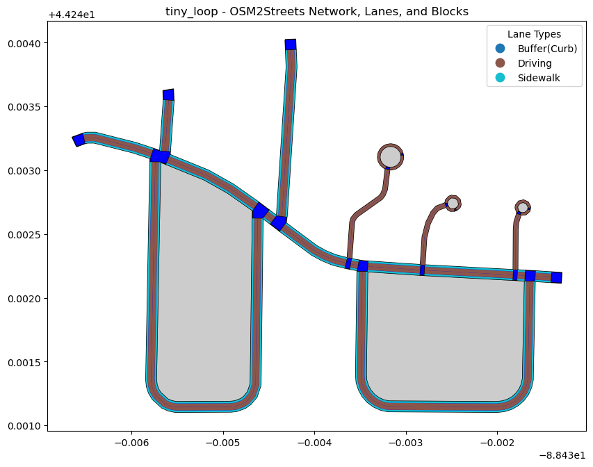

 

# KerbSide 

This documentation provides an overview of the KerbSide Generator, a tool that leverages the [osm2streets](https://github.com/a-b-street/osm2streets) Python wrapper to generate sidewalk data from OpenStreetMap (OSM). The tool allows users to download and process OSM tiles for a given location and outputs combined GeoDataFrames representing sidewalks, lanes, and intersections.

## Features
- Retrieve bounding box and OSMID for a location using geopy.
- Download OSM tiles within a bounding box, split into smaller tiles.
- Process downloaded tiles to generate sidewalks, lanes, and intersections.
- Fix or remove problematic geometries in OSM data.
- Validate generated geometries for consistency and compatibility.
- Output results in GeoJSON format.

Example output:

 

## Setup

### Requirements
- Python 3.7+
- Install dependencies:

```bash
pip install geopy requests geopandas pandas
```

- Install osm2streets-python:

KerbSide currently works with a custom implementation of osm2streets-python which includes some upgraded error handling not currently present in the main project. Thus please install the package via the following command: 

```bash 
pip install --no-cache-dir -e git+https://github.com/lukasbeuster/osm2streets.git@python_wrap#egg=osm2streets_python\&subdirectory=osm2streets-py
```


### Directory Structure

The script assumes the following directory structure:
- ../data/raw_data/osm2streets/location_cache.json: Stores cached location data.
- Output directories for tiles and processed files are automatically created under ../data/raw_data/osm2streets/{osmid}.

## Usage

### Running the Script

Use the command-line interface to specify the location, tile size, and driving side.

```bash
python KerbSide.py <location> [--tile_size <float>] [--driving_side <str>]
```

Arguments:
- location: Name of the location to process (e.g., "West, Amsterdam").
- --tile_size: Size of each tile in degrees (default: 0.01).
- --driving_side: Driving side of the region ("Right" or "Left", default: "Right").

#### Example:

```bash
python KerbSide.py "West, Amsterdam" --tile_size 0.02 --driving_side Left
```

% TODO: add example figures

### Key Functions

1. Location Handling

```python
get_location_info(geolocator, location_name)
```

Retrieves OSMID and bounding box for the specified location using the geopy geolocator.

```python
load_location_cache() / save_location_cache(cache)
```

Handles caching of location data to avoid redundant API calls.

2. Tile Management

```python
download_tiles(osmid, bbox, tile_size, output_dir)
```

Downloads OSM tiles within the specified bounding box, dividing the area into smaller tiles of the given size.
- Parameters:
    - osmid: OSM ID of the location.
    - bbox: Bounding box (min_lat, max_lat, min_lon, max_lon).
    - tile_size: Tile size in degrees.
    - output_dir: Directory for saving the tiles.

3. Data Processing

```python
process_tiles(tile_dir, input_options, output_dir)
```

Processes the downloaded OSM tiles to generate GeoDataFrames for sidewalks, lanes, and intersections.
- Parameters:
    - tile_dir: Directory containing OSM tiles.
    - input_options: Configuration for osm2streets.
    - output_dir: Directory for saving processed GeoDataFrames.

```python 
fix_or_remove_invalid_ways(osm_file, output_file)
```

Identifies and fixes or removes problematic ways in OSM data.

```python
validate_geometry(geojson_func)
```

Validates geometries generated by osm2streets and ensures they are compatible with GeoPandas.

4. Configuration Options

The script uses osm2streets with customizable input options:
- debug_each_step: Enable detailed debugging steps.
- dual_carriageway_experiment: Test dual carriageway handling.
- sidepath_zipping_experiment: Test sidepath zipping.
- inferred_sidewalks: Generate inferred sidewalks.
- inferred_kerbs: Generate inferred curbs.
- override_driving_side: Specify driving side ("Right" or "Left").

### Output

#### Generated Files

The script outputs the following GeoJSON files:
1.	combined_network.geojson: Combined sidewalk network.
2.	combined_lanes.geojson: Lane polygons.
3.	combined_intersections.geojson: Intersection markings.

#### Logs
	•	failed_tiles.txt: List of tiles that could not be processed.

### Error Handling

The script includes mechanisms to:
- Cache and reuse location data to minimize API queries.
- Detect and fix invalid geometries in OSM data.
- Skip invalid .osm files (empty, etc.) and log failures.

### Known issues

- some osm files cause the 

## Contributing

Contributions are welcome. Just open issues / pull requests.
